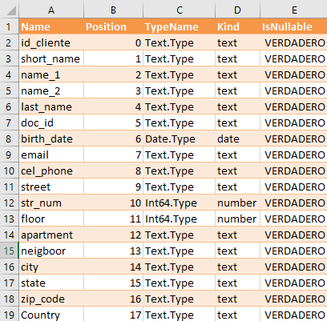

# Data needed for a project

Understanding what data is necessary for a data analysis project helps define its utility function. In general, best practices emerge from experience, both for defining essential data and for understanding the type of data that best represents it.
The table in the figure shows, for example, a data structure for a customer file or table.

This is a fairly straightforward data structure. 
To understand this, let's review the basic data types in a relational table or file.

---

## Explanation of Data Types

- **VARCHAR(n)**: Used for short text strings, where `n` is the maximum length.
- **TEXT**: Used to store long text, such as addresses and comments.
- **DATE**: For dates (format: YYYY-MM-DD).
- **TIMESTAMP**: For exact dates and times (format: YYYY-MM-DD HH:MM:SS).
- **DECIMAL(m, d)**: For monetary values, where `m` is the total number of digits and `d` is the number of decimal places.

---

## Key Validations

- **Email**: Must follow the format `user@domain.com`.
- **Phone**: Recommended international format `+54 9 11 1234 5678`.
- **Postal Code**: Must be valid according to the country.
- **Date of Birth**: Cannot be a future date.
- **Balance**: Cannot be negative.

---

## Analysis of Customer Address

When analyzing the customer data structure, we see that it does not provide sufficient information. Indeed, the table in the following figure shows a well-detailed data structure for a customer address. This includes a more comprehensive breakdown with data such as:

- Address number
- Neighborhood
- Floor
- Apartment
- Latitude
- Longitude for geolocation
